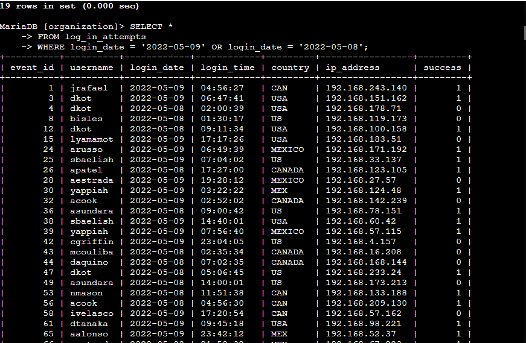
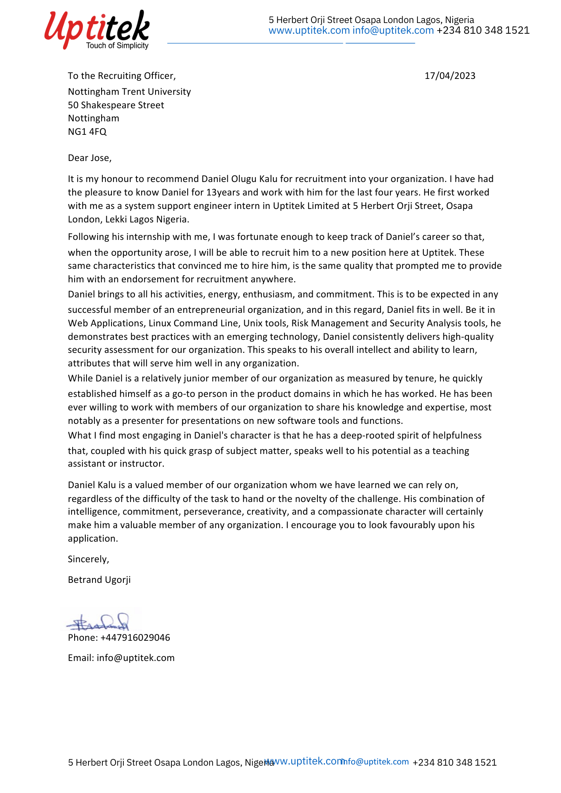

# MY CYBER PORTFOLIO     
  

# Daniel Kalu    
`Email: druel5050@yahoo.com`       
`Phone: +2348035232593`         
**System Support Specialist**     

**SUMMARY**       

I am a motivated system support engineer aiming for a position in your organization, where I can utilize my expertise in 
Unix tools, Linux administration skills, security policy, Network security and organizational risk management. 

**SKILLS & ABILITIES**

• Sed, Awk, Grep, Vi or VIM, Logs, SeLinux, Ansible, Bash, shell scripting, Cron, Storage, FileSystem.  
•	Scripting Languages: (Bash, PowerShell, Python, SQL)            
•	Operating Systems: (Windows, Linux, macOS, etc.)  
•	Vulnerability Assessment  
•	Linux command line              
•	Security frameworks                    
• Virtualization: (VMware, Hyper-V, etc.)     

**EXPERIENCE**

**SYSTEM SUPPORT SPECIALIST**  
UPTITEK LIMITED 2019 - 2023  

• Monitored and maintained systems to ensure optimal performance and uptime.  
• Performed regular updates, patches, and backups to keep systems secure and operational.   
• Used monitoring tools to identify and resolve system issues proactively.        
• Reduced system downtime by 0.01% through proactive monitoring and maintenance.       
• Conducted training sessions for end-users on new software, tools, and best practices.   
• Diagnosed and troubleshot system problems, escalating complex issues to senior engineers when necessary.   

### perfomed several database security task 
      

• Configured and managed user accounts, permissions, and access controls.  
• Automated repetitive tasks using scripts to improve efficiency and reduce manual errors.   
• Implemented and managed virtualization solutions, including VMware/Hyper-V      

### cybersecurity incident report on Network Analysis
       

**SOFTWARE SALES/TECH REP**    
  CAVSUSA 2012 - 2022     
•	Selling of karaoke software as a Nigerian Rep       
•	Karaoke software installations and trouble shooting    
• Conducted training sessions for end-users on new software, modules, and best guides.      
• Created and maintained technical documentation, including system configurations, procedures, and troubleshooting guides.    
• Successfully implemented facebook and Instagram marketing which brought 120% - 150% sales monthly.   

**EDUCATION**   

GOOGLE CYBERSECURITY CERTIFICATE – ONLINE – NOVEMBER 24, 2023         
QUALYS VULNERABILITY MANAGEMENT – ONLINE – NOVEMBER 11, 2022    
PYTHON - PROGRAMMING HUB          - ONLINE - NOVEMBER  23, 2021      
LINUX  - PROGRAMMING HUB          - ONLINE - AUGUST        2021       
INTRO TO CYBERSECURITY TOOLS & CYBER ATTACKS (IBM) – AUGUST 27, 2021     
UNIVERSITY OF CALABAR, BACHELOR OF SCIENCE IN PUBLIC ADMINISTRATION (23RD JULY 2012)     

### MY REFERENCE LETTER

<iframe width="640" height="360" src="https://www.youtube.com/embed/your-video-id" 
frameborder="0" allow="accelerometer; autoplay; clipboard-write; encrypted-media; gyroscope; picture-in-picture" allowfullscreen></iframe>

